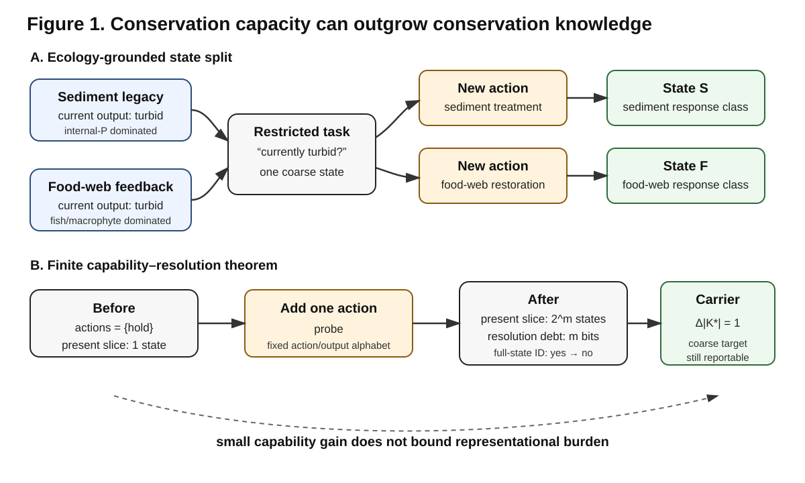

# When Conservation Capacity Outgrows Conservation Knowledge
## A Contract-Relative Theory of Ecological State

## Abstract

Ecologists and conservation practitioners routinely classify ecosystems by present states, yet the distinctions required for management can change when new interventions become possible. We develop Contract-Relative Ecological State Theory (CREST) to ask when different ecological worlds may legitimately count as the same state. CREST treats state as a scientifically licensed quotient of temporally extended ecological worlds and separates four questions: which worlds are jointly admissible, which distinctions a task requires, which distinctions available evidence identifies, and which target can nevertheless be reported. A shallow-lake worked case shows the practical issue: two currently turbid lakes can be equivalent for present-status reporting yet require different states once sediment-phosphorus treatment and food-web restoration become relevant alternatives. On a declared finite carrier, CREST constructs the unique coarsest state satisfying the implemented responsibilities. Its main quantitative result shows that, for every integer \(m\ge1\), one newly admitted controllable action can increase the viable carrier by exactly one world while forcing a retained present slice to refine from one state to \(2^m\) states. Under unchanged monitoring, full-state identification is lost and the resolution deficit is exactly \(m\) bits, while a coarse target remains reportable. The result formalizes a conservation-relevant asymmetry: **conservation capacity can outgrow conservation knowledge**. New capability can make an ecosystem more manageable while simultaneously making the old state description scientifically insufficient.

**Keywords:** philosophy of ecology; ecological state; conservation decision-making; scientific representation; model adequacy; monitoring

## 1. The ecological state problem begins with a conservation paradox

Conservation normally treats new management options as an increase in capability. A barrier can be removed, a population can be translocated, a nutrient source can be controlled, a food web can be manipulated, or a restoration technology can make previously unreachable ecological futures feasible. The intuitive direction is positive:

\[
\text{management repertoire increases}
\quad\Longrightarrow\quad
\text{management capacity increases}.
\]

But a second consequence is easy to miss. A new intervention can expose differences among ecosystems that were irrelevant under the old repertoire. Once those differences affect the outcome of an admissible management action, a state description that previously merged the systems may no longer be adequate. Thus management capacity can increase while the adequacy of existing knowledge decreases.

This paper develops that asymmetry as a theory of ecological state. The central question is:

> **When should different ecological worlds count as the same ecological state?**

The question is more basic than choosing a set of state variables. Ecologists routinely call lakes clear or turbid, populations persistent or declining, communities functionally intact or impaired, and landscapes connected or fragmented. Such descriptions are useful precisely because they merge many physically different systems into the same scientifically meaningful class. The problem is to determine when such a merge is legitimate.

Present similarity is not enough in general. Two ecosystems can have the same biomass, species richness, water-column nutrient concentration, or current functional output while differing in disturbance history, latent mechanism, basin position, or response to an intervention. Conversely, two physically different systems may legitimately share a coarse state when the differences between them are irrelevant to the question being asked. CREST therefore treats ecological state as a problem of **justified equivalence**, not as a synonym for a measurement vector.

This framing connects a familiar ecological problem to a familiar philosophical one. Models and other scientific representations simplify complex systems by abstraction and idealization (Odenbaugh 2005, 2019; Potochnik 2017). Different scientific aims can motivate different representations (Potochnik 2015, 2020), and model adequacy is appropriately assessed relative to purpose rather than by a single context-free standard (Parker 2020; Bokulich and Parker 2021). Biology also routinely uses higher-level descriptions that are multiply realized by heterogeneous lower-level structures, raising questions about when micro-level differences are irrelevant to macro-level regularities (Batterman 2000; Wimsatt 2007).

CREST accepts these lessons. Its contribution is not the claim that scientific representations are purpose-relative, that macroproperties can have multiple realizations, or that abstraction is unavoidable. It asks a narrower question that those general positions leave open in an ecological setting: **given a declared prediction, intervention, inherited category, evidence system, and target, exactly which ecological differences may remain inside one state class?** The answer is constrained by ecological response, not by convenience alone.

The conservation consequence is the paper's organizing claim:

\[
\boxed{
\text{conservation capacity can outgrow conservation knowledge.}
}
\]

A new management option can improve what can be done while simultaneously increasing what must be distinguished to say what state the system is in. The finite theorem later shows that the first increase can be fixed while the second is arbitrarily large.

## 2. Ecological state as scientifically constrained equivalence

### 2.1 Temporally extended ecological worlds

Ecological systems are not isolated snapshots. Current structure is produced by history, and current organisms, interactions, and traits constrain future responses. Eco-evolutionary feedbacks make this especially clear: ecological interactions can alter selection, while evolutionary change can alter ecological interactions and ecosystem function (Levin 1998; Post and Palkovacs 2009; Schoener 2011). CREST does not require ecosystems to be mathematically chaotic or evolution to follow a global direction. It requires only that relevant responses can depend on history, context, mechanism, or future operation.

Let \(\Omega\) be a set of admissible ecological worlds. A world can be represented as a complete trajectory

\[
\omega=(x_s)_{s\in\mathbb T},
\]

or, relative to a present time \(t\), schematically as

\[
\omega=(h_t,x_t,\mathcal F_t),
\]

where \(h_t\) is relevant history, \(x_t\) is present configuration, and \(\mathcal F_t\) is a future-response structure under interactions and interventions relevant to the problem. For a stochastic system, \(\mathcal F_t\) can be a conditional distribution over future trajectories rather than a predetermined future.

This is a representational device, not a metaphysical commitment to a block universe or physical determinism. Its purpose is to keep open the possibility that two numerically identical present snapshots belong to different response-relevant histories or counterfactual futures.

### 2.2 Scientific access and scientific responsibility

Scientists do not observe \(\omega\) directly. A measurement and intervention context \(V\) determines which distinctions are accessible:

\[
O_V:\Omega\to Y_V.
\]

CREST separates this access from the responsibility assigned to the state representation. Write a scientific contract schematically as

\[
\mathcal C=(\Gamma,\mathcal H,\Theta,D;T),
\]

where \(\Gamma\) specifies future operations that the state must support, \(\mathcal H\) inherited meanings or historical distinctions that must remain coherent, \(\Theta\) retained mechanism or response alternatives, \(D\) the evidence architecture, and \(T\) the requested report or decision target.

Two worlds satisfy

\[
\omega\sim_{\mathcal C,V}\omega'
\]

when they can be treated as interchangeable for the work specified by \((\mathcal C,V)\). The quotient map

\[
q_{\mathcal C,V}:\Omega\to Q_{\mathcal C,V}
\]

defines the state:

\[
\boxed{
\operatorname{State}_{\mathcal C,V}(\omega)
=[\omega]_{\sim_{\mathcal C,V}}.
}
\]

An ecological state is therefore a scientifically licensed quotient of possible ecological worlds.

This contract-relativity is not conventionalism. Scientists may choose a question, but they cannot choose its answer. If two worlds merged by a proposed state give different responses to an operation that the contract requires the state to support, that merge is inadequate regardless of whether it is convenient.

### 2.3 What makes a contract well posed?

Purpose-relative adequacy raises an obvious concern: if any purpose can be declared, does any state classification become defensible? CREST separates two issues that should not be conflated. Whether a scientific aim is ethically or institutionally worthwhile is a normative question that the present theory does not settle. But a contract can still be **formally ill posed** for state analysis.

A CREST contract is well posed only when at least four conditions are satisfied.

1. **Independent responsibility.** The response, intervention set, and target are specified independently of the candidate quotient. One cannot define the task post hoc as whatever a preferred state classification happens to predict.
2. **Non-vacuous domain.** The declared obligations share a nonempty admissible world set covering the systems to which the state is intended to apply.
3. **Response testability.** A proposed merge has an empirical or model-based failure condition: if merged worlds disagree on a required response, inherited meaning, or target, the merge fails.
4. **Evidence accountability.** The state that the task requires is kept distinct from the state that the available observations actually identify.

These conditions do not select one uniquely valuable scientific purpose. They prevent task-relativity from collapsing into arbitrary relabelling. They also show what CREST adds to a general adequacy-for-purpose position. Adequacy-for-purpose tells us that a representation should be judged relative to its aim. CREST asks whether a particular **state merge** survives the response responsibilities of that aim, whether the relevant worlds can even be placed on one admissible carrier, and whether the available evidence licenses the resulting distinction.

### 2.4 Snapshot sufficiency and quotient laws

Let the current snapshot map be

\[
X:\Omega\to\mathcal X.
\]

A present snapshot is sufficient exactly when the required state factors through it:

\[
\boxed{
X(\omega)=X(\omega')
\Longrightarrow
q_{\mathcal C,V}(\omega)=q_{\mathcal C,V}(\omega').
}
\]

This is a factorization criterion, not a claim that snapshots are generally inadequate. In many ecological tasks, present observables will be sufficient. CREST requires sufficiency to be demonstrated relative to the responsibility rather than assumed from temporal immediacy.

The same relation determines when a coarse ecological law is well defined. Let

\[
R_{\mathcal C}:\Omega\to Z_{\mathcal C}
\]

be the response required by the contract. A coarse rule exists on the state space only if there is a map

\[
L_{\mathcal C,V}:Q_{\mathcal C,V}\to Z_{\mathcal C}
\]

such that

\[
\boxed{
R_{\mathcal C}=L_{\mathcal C,V}\circ q_{\mathcal C,V}.
}
\]

Thus a coarse ecological law is an effective law on an adequate quotient. This is compatible with philosophical accounts of abstraction and multiple realization: heterogeneous worlds can support the same macroregularity precisely while the heterogeneity lies within fibers on which the required response is constant. A new intervention can destroy that multiple realization by making a previously irrelevant difference response-relevant.

## 3. A worked ecological case: shallow-lake restoration

A formal theory of ecological state needs to show what work its distinctions do in an ecological system. Shallow-lake eutrophication provides a useful case because long-term studies document both delayed recovery after nutrient reduction and multiple supplementary restoration channels. Reduced external nutrient loading often improves water quality, yet internal phosphorus loading can delay recovery, and biological feedbacks involving fish and submerged macrophytes can stabilize turbid conditions or contribute to relapse (Scheffer et al. 2001; Jeppesen et al. 2005; Søndergaard et al. 2007).

The purpose of this section is not to fit a CREST model to a particular lake. It is an ecology-grounded finite worked case showing how the state question changes when management responsibility changes.

### 3.1 Two worlds with the same current management snapshot

Consider two possible lake worlds compatible with the same coarse current observation `turbid` after external phosphorus loading has been reduced.

- **World S — sediment legacy.** A mobile sediment phosphorus pool accumulated during the previous high-loading period sustains internal loading. A sediment-focused intervention can change the recovery trajectory.
- **World F — food-web feedback.** A fish-dominated food web and failure of submerged macrophytes to re-establish help maintain turbidity. Biomanipulation or macrophyte restoration can change the recovery trajectory.

Real lakes can of course contain mixtures of these mechanisms. The two-world construction is not a claim that lakes fall into two natural kinds. It isolates the state issue.

Let the recovery world \(C\) denote a clear-water state. Consider three management actions:

\[
L=\text{continued external-load reduction},
\qquad
S=\text{sediment-focused treatment},
\qquad
F=\text{food-web/macrophyte intervention}.
\]

An illustrative finite response table is:

| present world | current output | \(L\) | \(S\) | \(F\) |
|---|---|---|---|---|
| sediment legacy \(S_w\) | turbid | \(S_w\) | \(C\) | \(S_w\) |
| food-web feedback \(F_w\) | turbid | \(F_w\) | \(F_w\) | \(C\) |
| recovered \(C\) | clear | \(C\) | \(C\) | \(C\) |

The table is deliberately schematic. It encodes qualitative intervention channels documented in the restoration literature; it does not assign empirical transition probabilities or claim that any single treatment deterministically restores every real lake.

### 3.2 Gate A: can the worlds share the declared management problem?

For this finite illustration, all three worlds and all three actions belong to one declared management model, so a common carrier exists. In a real application this would be a substantive requirement: a proposed joint state cannot repair a contract whose candidate worlds or action responsibilities are mutually incompatible.

### 3.3 Gate B: what state resolution does the task require?

For the narrow descriptive target

> is the lake currently turbid or clear?

\(S_w\) and \(F_w\) can occupy one state. The quotient

\[
\{S_w,F_w\}\mid\{C\}
\]

is adequate.

Now change the responsibility:

> which supplementary restoration channel is expected to recover the clear-water state?

Under the enlarged action repertoire \(\{L,S,F\}\), the old turbid fiber is no longer sound. \(S_w\) and \(F_w\) disagree under both supplementary actions, so the least exact state for this toy system is

\[
\{S_w\}\mid\{F_w\}\mid\{C\}.
\]

Nothing physical about the lake needs to change at the moment the management repertoire is enlarged. What changes is which counterfactual responses the state must preserve.

### 3.4 Gate C: what does routine evidence identify?

Suppose routine evidence records only current water-column status. Its evidence partition is then

\[
E_{\mathrm{routine}}
=
\{S_w,F_w\}\mid\{C\}.
\]

This evidence is fully adequate for the current-status target but does not identify the refined intervention-response state. The scientifically correct result is not that routine monitoring has become false or useless. It is that the same record supports a coarser claim than the new management problem requires.

Additional measurements of sediment phosphorus, fish-community structure, or macrophyte recovery can refine the evidence toward the distinction the intervention target needs. Merely increasing replication of a water-column variable that remains mechanistically non-discriminating need not solve the problem.

The case therefore ends with the CREST separation

\[
\boxed{
\text{required state}
\neq
\text{identified state}
\neq
\text{reportable target}.
}
\]

It also identifies a concrete ecological disagreement that a generic adequacy-for-purpose slogan alone does not settle. The label `turbid lake` can be entirely adequate for current status and formally inadequate for choosing between sediment-focused and food-web-focused restoration. Once the intervention target is declared, the response table decides whether the merge survives.

**Figure 1.** Left: two currently similar shallow-lake worlds can share a coarse state under a restricted responsibility but split when mechanism-specific restoration actions enter the management repertoire. Right: the finite capability–resolution construction generalizes this logic: a single new action can expose arbitrarily many present distinctions while adding only one viable world.

## 4. The finite CREST architecture

The worked case is intentionally small. CREST's finite theory states the same logic for a general declared finite carrier.

### 4.1 Gate A — admissible carrier

The companion responsibilities do not automatically live on the same latent world set. CREST therefore separates carrier feasibility from state construction.

For a universal-action responsibility, descending iteration yields the greatest synchronized transition-closed carrier \(U^*\). For a controlled responsibility, all uncontrollable moves must remain safe while at least one admissible control is available; the corresponding construction yields the greatest robustly controlled-invariant carrier \(K^*\).

An empty or coverage-incomplete carrier is not fixed by splitting state classes more finely. It means the declared responsibilities cannot all be represented on one admissible world set without changing the contract.

### 4.2 Gate B — least-information adequate state

On an admissible finite carrier \(U\), let \(B\) be a baseline partition. Represent the implemented responsibilities by monotone, inflationary, idempotent refinement closures

\[
C_\Gamma,\qquad
C_{\mathcal H},\qquad
C_\Theta,\qquad
C_{D,T}.
\]

Their common closure above the baseline is

\[
\boxed{
J=(C_\Gamma\vee C_{\mathcal H}\vee C_\Theta\vee C_{D,T})(B).
}
\]

Under the stated assumptions, \(J\) is the unique coarsest partition satisfying the implemented requirements. For \(u\in U\),

\[
\operatorname{State}_{\mathcal C}(u)=[u]_J.
\]

This conditional least-state result is foundational but not the paper's principal novelty. Partition lattices, closure operators, fixed points, and finite-state minimization are classical. Their role is to make the ecological state question exact.

### 4.3 Gate C — evidence identification

Let \(E_D\) be the reliability-qualified evidence partition. Full deterministic state reporting is licensed exactly when

\[
\boxed{
J\preceq E_D.
}
\]

If this fails, \(J\) still specifies the distinctions the task requires, but the evidence does not identify a unique state. A requested target can nevertheless remain deterministic when it factors through \(E_D\). Thus CREST distinguishes state requirements from evidential achievement.

Detailed definitions, proofs, witnesses, and executable checks are given in the Supplementary Information.

## 5. Main result: capability–resolution divergence

The qualitative direction is immediate: enlarging a future or management repertoire can make more worlds viable and can also refine the state needed to represent their responses. The nontrivial question is whether the representational increase must be commensurate with the capability gain.

The answer is no.

### Theorem — capability–resolution divergence

For every integer \(m\ge1\), there exists a finite deterministic controlled system in which adding a **single** controllable action `probe` gives

\[
\boxed{
\Delta|K^*|=1,
\qquad
\Delta K_{U_0}=m.
}
\]

Here \(K^*\) is the greatest robust controlled carrier and

\[
K_{U_0}(J)=\log_2|J\restriction_{U_0}|
\]

is state complexity on a retained present slice \(U_0\).

Before expansion, the present slice contains \(2^m\) worlds that are equivalent under the only old action `hold`. The least exact state therefore has one class on \(U_0\). After `probe` is admitted, repeated use of that same action reveals one binary coordinate at a time, so every pair of present worlds can be distinguished by some finite future word. The least exact state therefore has \(2^m\) classes on \(U_0\), an increase of exactly \(m\) bits.

The same `probe` trajectories terminate in one additional compatible world `fragile`. Under the old repertoire `fragile` lacks a safe action. Under the expanded repertoire `probe` carries it to a safe sink, so the robust controlled carrier grows by exactly one world. The readout and rescue effects occur in one connected future-response graph rather than in disjoint gadgets.

Now hold the evidence on \(U_0\) fixed at one record class. Before expansion it identifies the single required state. After expansion it merges \(2^m\) required states, creating exactly \(m\) bits of monitoring-resolution debt. Full-state licensing changes from yes to no. Yet a target constant on \(U_0\) remains reportable throughout.

Thus one fixed-size capability expansion realizes

\[
\boxed{
\Delta|K^*|=1,
\quad
\Delta K_{U_0}=m,
\quad
D_{U_0}:0\to m,
\quad
\text{full state: yes}\to\text{no},
\quad
\text{target: yes}\to\text{yes}.
}
\]

### Corollary — no carrier-gain-only upper bound

There is no universal finite function \(f\) depending only on carrier-size gain such that

\[
\Delta K_{U_0}\le f(\Delta|K^*|)
\]

for all such contracts. The family fixes \(\Delta|K^*|=1\) while \(m\) is arbitrary.

The theorem is an extremal existence result. It does **not** predict exponential state growth in typical ecosystems. Its role is to rule out a general inference: without additional ecological structure, small improvement in the number of viable worlds does not guarantee small increase in the information required for an adequate state.

This is stronger than the qualitative observation that state abstractions can depend on available actions. State/action coupling is established in reinforcement learning and controlled-system representation (Konidaris 2019), and future-test-defined state is central to Predictive State Representations (Littman et al. 2002; Singh et al. 2004). CREST's theorem concerns the scale separation across four linked quantities—carrier feasibility, least-state complexity, evidence adequacy, and target reportability—in one connected construction.

## 6. Conservation capacity can outgrow conservation knowledge

The theorem's main ecological use is not a recommendation to measure everything. It identifies a structural tension between intervention and representation.

### 6.1 New capability can invalidate old state knowledge before anything is done

Suppose a conservation programme gains a new intervention: assisted migration, corridor construction, targeted removal, biomanipulation, rewetting, or another operation that differentiates previously merged worlds. The operation need not be executed. If the programme now requires the state to support predictions under that operation, a formerly adequate state can become inadequate immediately.

This is representational change without physical ecological change. The ecosystem has not been altered by the mere availability of the intervention. The scientific question has changed, and with it the equivalence relation needed to answer that question.

### 6.2 Better decision capacity need not mean better state knowledge

The finite family also shows that a management target can remain reportable when full-state identification is lost. That is important because conservation science often evaluates monitoring by whether it supports decisions. CREST shows why successful decision support and complete state identification should not be conflated:

\[
\boxed{
\text{decision-safe target knowledge}
\not\Rightarrow
\text{full ecological-state knowledge}.
}
\]

This is not a defect. A coarse target may be all that a decision requires. But it changes what can legitimately be inferred from a successful management decision.

### 6.3 The limiting resource can be measurement type rather than sample size

When the newly relevant distinction lies in a latent response mechanism, collecting more observations of the same aggregate channel may leave the state unresolved. A monitoring programme can therefore face a structural deficit rather than a merely statistical one. The appropriate repair may be a different measurement channel, not greater replication.

### 6.4 A conservation-state category is partly defined by feasible intervention space

Labels such as `recoverable`, `restoration-ready`, `functionally redundant`, or `managed stable` are not simply properties of a momentary snapshot when their scientific meaning includes intervention response. Two populations or ecosystems can occupy one state under one management repertoire and require different states under another.

This does not make ecological reality socially constructed by management. The worlds and their response differences are independent constraints. What management changes is which of those real differences the state must preserve.

The resulting principle is:

\[
\boxed{
\text{when the management repertoire changes, state adequacy must be re-audited.}
}
\]

The shallow-lake case shows the principle concretely. `Currently turbid` remains a valid coarse description when sediment treatment and food-web intervention become available. What fails is the inference that one `turbid` state is sufficient for predicting which supplementary restoration path will work.

The same logic can arise in other conservation settings whenever new actions make dormant differences operational: connectivity restoration can expose dispersal-source differences, assisted migration can expose genotype-by-environment response differences, and targeted species removal can expose alternative interaction structures. These are theoretical projections of the state criterion, not empirical validations of the extremal theorem.

## 7. Relation to abstraction, adequacy, and multiple realization

CREST sits at the intersection of several established literatures, and its claim is clearest when stated positively rather than by a long list of exclusions.

First, philosophy of modelling has shown why idealization and abstraction are indispensable in complex sciences. Odenbaugh (2005, 2019) emphasizes the idealized character of ecological models; Potochnik (2017) argues that scientific representation necessarily simplifies complex causal structure and serves diverse epistemic and practical aims. CREST adds a formal question about the **state variable itself**: for a declared responsibility, which differences may occupy the same state without changing the required response?

Second, adequacy-for-purpose accounts correctly make evaluation task-relative (Parker 2020; Bokulich and Parker 2021). CREST does not replace that framework. It provides a state-specific diagnostic inside it. Once the task is declared, a proposed state merge either preserves the required responses or it does not. The shallow-lake example illustrates the difference: both a coarse `turbid/clear` representation and a mechanism-sensitive representation can be legitimate scientific products, but only the latter is adequate for the declared target of choosing between mechanism-specific restoration actions.

Third, multiple-realizability and levels-of-description debates ask how heterogeneous lower-level systems can support the same higher-level regularity (Batterman 2000; Wimsatt 2007). CREST gives this issue an intervention-sensitive ecological form. Micro- or history-level heterogeneity can remain inside one macrostate while every responsibility-relevant response is invariant. A newly relevant intervention can break the macroequivalence by making one formerly hidden realization respond differently.

Fourth, predictive-state, causal-abstraction, POMDP, and state/action-abstraction theories already provide powerful controlled-system formalisms (Shalizi and Crutchfield 2001; Littman et al. 2002; Singh et al. 2004; Beckers and Halpern 2019; Konidaris 2019). CREST does not claim greater expressive power. Its explanatory target is different: it separates ecological-world admissibility, task-required state, evidence-identified state, reportable target, and quotient-law validity so that failures at these layers are not mistaken for one another. The quantitative result then couples those layers in a single no-bound construction.

Finally, ecology itself has a long history of questioning the transferability and adequacy of state variables and models. Ecological model-adequacy frameworks explicitly scrutinize state variables and controls (Getz et al. 2018), conservation POMDPs ask which states matter for decisions (Nicol and Chadès 2012; Chadès et al. 2021), State-and-Transition Models make state concepts management-sensitive (Stringham et al. 2003), and model transferability under novel conditions is a recognized challenge (Yates et al. 2018). CREST's contribution is to place these concerns under one state-sameness question and to show that expanding what can be done can have a mathematically disproportionate effect on what must be represented.

## 8. Limits and conclusion

CREST does not provide one universal partition of nature. Its state is conditional on a well-posed scientific responsibility, and different responsibilities can legitimately yield different state spaces. Nor does CREST infer the correct intervention grammar, mechanism family, historical variables, evidence system, or normative target from data. Those remain substantive scientific and, in some cases, ethical choices.

The present proofs are finite and exact. Infinite-state, continuous-time, stochastic, approximate, and delayed-control generalizations require additional mathematics. The capability–resolution theorem is an existence result and does not claim that real ecosystems generally exhibit exponential state growth. Its conclusion is negative and conditional: a carrier-gain-only bound is unavailable without additional structural assumptions.

The worked shallow-lake example is likewise not an empirical performance test of CREST. It demonstrates that the theory makes a concrete distinction in an ecological management problem using intervention channels independently supported by the lake-restoration literature. A full empirical application would require data-driven specification of the possible worlds, response model, evidence partition, and comparison against alternative representations.

The philosophical claim is also limited. CREST does not say that every scientific aim is equally good or that ecological truth is observer-relative. It says that scientific states are representations with responsibilities, and a state merge is legitimate only while the ecological differences inside it do not change what that representation is required to support.

The central result can therefore be stated without the full formal vocabulary. An ecosystem can become **more manageable** while becoming **harder to represent adequately**. A new intervention can expose distinctions that were previously irrelevant, and the amount of newly required state information need not be bounded by the gain in viable ecological worlds. Under fixed monitoring, this can make full-state knowledge fail even while a coarser management target remains answerable.

Hence:

\[
\boxed{
\textbf{conservation capacity can outgrow conservation knowledge.}
}
\]

This is not because new management changes the ecosystem before it is applied. It is because new capability changes which counterfactual differences a scientifically adequate present state must preserve. CREST turns that conservation paradox into a precise question about ecological state, evidence, and the domain of coarse ecological laws.

## References

Batterman RW (2000) Multiple realizability and universality. British Journal for the Philosophy of Science 51:115–145. https://doi.org/10.1093/bjps/51.1.115

Beckers S, Halpern JY (2019) Abstracting causal models. Proceedings of the AAAI Conference on Artificial Intelligence 33:2678–2685. https://doi.org/10.1609/aaai.v33i01.33012678

Bokulich A, Parker W (2021) Data models, representation and adequacy-for-purpose. European Journal for Philosophy of Science 11:31. https://doi.org/10.1007/s13194-020-00345-2

Chadès I, Pascal LV, Nicol S, Fletcher CS, Ferrer-Mestres J (2021) A primer on partially observable Markov decision processes (POMDPs). Methods in Ecology and Evolution 12:2058–2072. https://doi.org/10.1111/2041-210X.13692

Collier J, Cumming GS (2011) A dynamical approach to ecosystem identity. In: Philosophy of Ecology, Handbook of the Philosophy of Science, Vol 11. Elsevier, pp 201–218. https://doi.org/10.1016/B978-0-444-51673-2.50008-X

Cumming GS, Collier J (2005) Change and identity in complex systems. Ecology and Society 10:29. https://doi.org/10.5751/ES-01252-100129

Delettre O (2021) Identity of ecological systems and the meaning of resilience. Journal of Ecology 109:3147–3156. https://doi.org/10.1111/1365-2745.13655

Fackler P, Pacifici K (2014) Addressing structural and observational uncertainty in resource management. Journal of Environmental Management 133:27–36. https://doi.org/10.1016/j.jenvman.2013.11.004

Getz WM, Marshall CR, Carlson CJ, Giuggioli L, Ryan SJ, Romañach SS, Boettiger C, Chamberlain SD, Larsen L, D'Odorico P, O'Sullivan D (2018) Making ecological models adequate. Ecology Letters 21:153–166. https://doi.org/10.1111/ele.12893

Jeppesen E, Søndergaard M, Jensen JP, Havens KE, Anneville O, Carvalho L, Coveney MF, Deneke R, Dokulil MT, Foy B et al (2005) Lake responses to reduced nutrient loading – an analysis of contemporary long-term data from 35 case studies. Freshwater Biology 50:1747–1771. https://doi.org/10.1111/j.1365-2427.2005.01415.x

Konidaris G (2019) On the necessity of abstraction. Current Opinion in Behavioral Sciences 29:1–7. https://doi.org/10.1016/j.cobeha.2018.11.005

Levin SA (1998) Ecosystems and the biosphere as complex adaptive systems. Ecosystems 1:431–436. https://doi.org/10.1007/s100219900037

Littman ML, Sutton RS, Singh S (2002) Predictive representations of state. Advances in Neural Information Processing Systems 14:1555–1561

Nicol S, Chadès I (2012) Which states matter? An application of an intelligent discretization method to solve a continuous POMDP in conservation biology. PLoS ONE 7:e28993. https://doi.org/10.1371/journal.pone.0028993

Odenbaugh J (2005) Idealized, inaccurate but successful: a pragmatic approach to evaluating models in theoretical ecology. Biology & Philosophy 20:231–255. https://doi.org/10.1007/s10539-004-0478-6

Odenbaugh J (2019) Ecological Models. Cambridge University Press, Cambridge. https://doi.org/10.1017/9781108685283

Parker WS (2020) Model evaluation: an adequacy-for-purpose view. Philosophy of Science 87:457–477. https://doi.org/10.1086/708691

Post DM, Palkovacs EP (2009) Eco-evolutionary feedbacks in community and ecosystem ecology: interactions between the ecological theatre and the evolutionary play. Philosophical Transactions of the Royal Society B 364:1629–1640. https://doi.org/10.1098/rstb.2009.0012

Potochnik A (2015) The diverse aims of science. Studies in History and Philosophy of Science Part A 53:71–80. https://doi.org/10.1016/j.shpsa.2015.05.008

Potochnik A (2017) Idealization and the Aims of Science. University of Chicago Press, Chicago

Potochnik A (2020) Idealization and many aims. Philosophy of Science 87:933–943. https://doi.org/10.1086/710622

Scheffer M, Carpenter S, Foley JA, Folke C, Walker B (2001) Catastrophic shifts in ecosystems. Nature 413:591–596. https://doi.org/10.1038/35098000

Schoener TW (2011) The newest synthesis: understanding the interplay of evolutionary and ecological dynamics. Science 331:426–429. https://doi.org/10.1126/science.1193954

Shalizi CR, Crutchfield JP (2001) Computational mechanics: pattern and prediction, structure and simplicity. Journal of Statistical Physics 104:817–879

Singh S, James MR, Rudary MR (2004) Predictive state representations: a new theory for modeling dynamical systems. Proceedings of the 20th Conference on Uncertainty in Artificial Intelligence, pp 512–519

Søndergaard M, Jeppesen E, Lauridsen TL, Skov C, Van Nes EH, Roijackers R, Lammens E, Portielje R (2007) Lake restoration: successes, failures and long-term effects. Journal of Applied Ecology 44:1095–1105. https://doi.org/10.1111/j.1365-2664.2007.01363.x

Stringham TK, Krueger WC, Shaver PL (2003) State and transition modeling: an ecological process approach. Journal of Range Management 56:106–113. https://doi.org/10.2307/4003893

Wimsatt WC (2007) Re-Engineering Philosophy for Limited Beings: Piecewise Approximations to Reality. Harvard University Press, Cambridge, MA

Yates KL, Bouchet PJ, Caley MJ, Mengersen K, Randin CF, Parnell S, Fielding AH, Bamford AJ, Ban S, Barbosa AM et al (2018) Outstanding challenges in the transferability of ecological models. Trends in Ecology & Evolution 33:790–802. https://doi.org/10.1016/j.tree.2018.08.001
